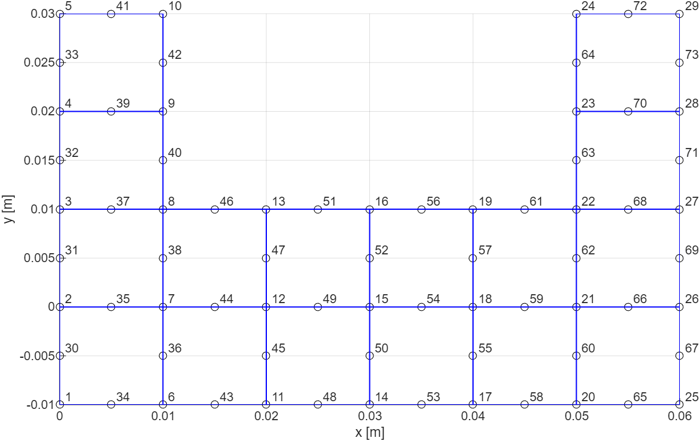
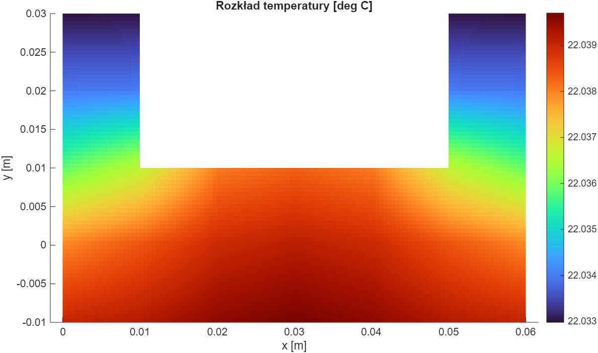
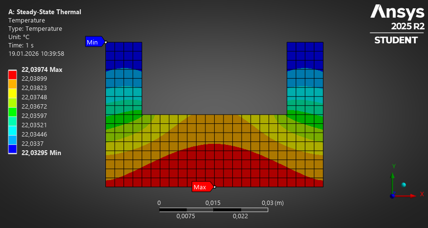

# FEM Heat Transfer Solver in MATLAB

Custom 2D finite element method (FEM) solver for steady-state heat transfer analysis implemented in MATLAB.  
The project includes automatic mesh generation, custom 8-node rectangular finite elements, convection boundary conditions, volumetric heat sources and numerical verification against ANSYS simulations.

---

# Project Overview

The purpose of this project was to develop a numerical solver capable of analyzing steady-state heat conduction in a complex 2D geometry using the finite element method.

The implementation includes:

- Custom formulation of 8-node rectangular finite elements
- Automatic mesh generation based on polygon geometry
- Heat source and convection boundary conditions
- Global stiffness matrix assembly
- Numerical solution of the FEM system
- Mesh independence study
- Verification using ANSYS
- Secant method implementation for thermal optimization

The solver was developed entirely from scratch in MATLAB without external FEM libraries.

---

# Mathematical Model

The temperature distribution is governed by the steady-state heat conduction equation:

```math
\frac{\partial}{\partial x}\left(k_x \frac{\partial T}{\partial x}\right)
+
\frac{\partial}{\partial y}\left(k_y \frac{\partial T}{\partial y}\right)
+ Q = 0
```

The implementation uses:

- Galerkin formulation
- Green-Gauss-Ostrogradsky theorem
- 8-node rectangular finite elements
- Numerical assembly of local and global matrices

The following matrices were implemented:

- Conductivity matrix
- Boundary condition matrices
- Heat source vectors
- Convection boundary matrices

---

# Features

- 2D steady-state thermal FEM analysis
- Custom 8-node finite elements
- Automatic structured mesh generation
- Convection boundary conditions
- Volumetric heat source support
- Global matrix assembly
- Temperature field visualization
- Mesh independence analysis
- Numerical verification with ANSYS
- Secant method optimization

---

# Technologies Used

- MATLAB
- Finite Element Method (FEM)
- Numerical Methods
- PDE Solving
- Engineering Simulations
- Scientific Computing

---

# Project Structure

```text
.
├── code/
│   ├── generate_symbolic_element.m
│   ├── fem_heat_solver.m
│   └── find_maximum_heat_source.m
│
├── images/
│   ├── a.png
│   ├── b.png
│   └── c.png
│
├── results/
│   ├── a.jpg
│   └── b.jpg
│
└── README.md
```

---

# FEM Workflow

The implemented workflow consists of:

1. Geometry definition using polygon vertices
2. Structured point generation
3. Automatic mesh creation
4. Generation of 8-node FEM elements
5. Local matrix computation
6. Global matrix assembly
7. Boundary condition application
8. Linear system solution
9. Temperature field visualization
10. Verification and optimization

---

# Mesh Generation

The mesh generation process was implemented manually.

The geometry is defined using polygon vertices and automatically filled with structured nodes. Additional midpoint nodes are generated to create 8-node rectangular elements.

The implementation supports:

- Arbitrary polygon-based geometries
- Automatic node generation
- Element connectivity creation
- Boundary edge detection

---

# Boundary Conditions

The solver supports:

## Convection Boundary Conditions

Applied on selected edges using:

```math
q = h(T - T_\infty)
```

where:

- \( h \) — heat transfer coefficient
- \( T_\infty \) — ambient temperature

## Volumetric Heat Sources

Heat generation is applied selectively to chosen regions of the model.

---

# Results

The solver successfully produced stable and symmetric temperature distributions for all tested mesh sizes.

A mesh independence study was performed for element sizes:

- 10 mm
- 5 mm
- 2.5 mm

The results showed excellent numerical convergence and stability.

---

# ANSYS Verification

The FEM implementation was verified using ANSYS Steady-State Thermal simulations.

Comparison results:

| Source | Tmax [°C] | Tmin [°C] |
|---|---|---|
| MATLAB | 22.03974 | 22.03294 |
| ANSYS | 22.03974 | 22.03295 |

The numerical error was approximately:

```text
~ 10^-5 %
```

which confirms the correctness of the implementation.

---

# Thermal Optimization

An additional optimization task was implemented using the secant method.

The goal was to determine the maximum volumetric heat source value for which the temperature anywhere in the model does not exceed:

```text
35 °C
```

The algorithm converged after 4 iterations.

Final result:

```text
Q = 261940 W/m³
Tmax = 34.9998 °C
```

---

# Visualization

The solver includes visualization of:

- FEM mesh
- Temperature distribution
- Node numbering
- Simulation results

---

# Example Screenshots

## FEM Mesh



## Temperature Distribution



## ANSYS Verification



---

# How to Run

## Requirements

- MATLAB R2021a or newer

## Run symbolic FEM matrix generation

```matlab
run generate_symbolic_element.m
```

## Run the main simulation

```matlab
run fem_heat_solver.m
```

## Run secant method optimization

```matlab
run find_maximum_heat_source.m
```

---

# Future Improvements

Possible future extensions:

- Sparse matrix implementation
- Unstructured mesh generation
- Transient thermal analysis
- Parallel computations
- GUI interface
- Export to VTK/ParaView
- Python or C++ implementation
- Dockerized simulation environment

---

# Author

Wiktor Komorowski
